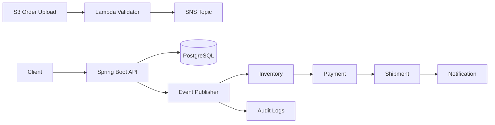

# Event-Driven Order Processing Platform

Enterprise-style e-commerce order processing platform built with Java 21, Spring Boot 3, PostgreSQL, JWT security, and AWS serverless design patterns. The project is designed as a GitHub: runnable locally, documented thoroughly, and structured for cloud deployment.

## Features

- JWT authentication with access and refresh tokens
- Role-based access for `ADMIN`, `CUSTOMER`, and `SUPPORT`
- Order lifecycle: `CREATED`, `VALIDATED`, `PAYMENT_PENDING`, `PAID`, `SHIPPED`, `DELIVERED`, `FAILED`
- Asynchronous event flow for inventory, payment, shipment, notification, and audit
- Mock payment gateway with Spring Retry and DLQ recovery hook
- PostgreSQL schema managed by Flyway
- Correlation IDs and structured logging
- OpenAPI/Swagger documentation
- Docker, Docker Compose, GitHub Actions CI, and AWS deployment notes
- Lambda handler for S3 order upload ingestion

## Architecture



More diagrams are available in [docs/diagrams/architecture.md](docs/diagrams/architecture.md).

## Tech Stack

| Area | Technology |
| --- | --- |
| Backend | Java 21, Spring Boot 3, Maven |
| Database | PostgreSQL, Flyway |
| Security | Spring Security, JWT, BCrypt |
| AWS Design | Lambda, API Gateway, S3, SNS, SQS, DynamoDB, CloudWatch, Secrets Manager, IAM |
| Testing | JUnit 5, Mockito, Spring Boot Test, JaCoCo |
| DevOps | Docker, Docker Compose, GitHub Actions |
| Documentation | OpenAPI, Mermaid, Markdown |

## Project Structure

```text
src/main/java/com/example/orderplatform
  auth          JWT, users, roles, auth API
  common        API response, exceptions, correlation ID filter
  config        Spring Security configuration
  events        Domain events and publisher abstraction
  order         Order aggregate, API, service, repository
  inventory     Stock reservation and stock management
  payment       Mock gateway, retry, DLQ recovery
  shipment      Shipment generation
  notification  Email/SMS event publishing
  audit         Immutable event audit storage
  lambda        S3 upload Lambda handler
docs            Architecture, tradeoffs, scaling, security, cost, OpenAPI
```

## Run Locally

Prerequisites: Java 21, Maven 3.9+, Docker.

```bash
docker compose up -d postgres
mvn spring-boot:run
```

Swagger UI:

```text
http://localhost:8080/swagger-ui.html
```

Run all tests and coverage:

```bash
mvn clean verify
```

Coverage report:

```text
target/site/jacoco/index.html
```

Run full stack with Docker:

```bash
docker compose up --build
```

## API Examples

Register:

```bash
curl -X POST http://localhost:8080/api/v1/auth/register \
  -H "Content-Type: application/json" \
  -d '{"email":"customer@example.com","password":"StrongPass123","fullName":"Customer One","roles":["CUSTOMER"]}'
```

Create order:

```bash
curl -X POST http://localhost:8080/api/v1/orders \
  -H "Authorization: Bearer <token>" \
  -H "Content-Type: application/json" \
  -d @scripts/sample-order.json
```

## Database

The schema includes `users`, `roles`, `user_roles`, `orders`, `order_items`, `inventory`, `payments`, `shipments`, and `audit_logs`. Indexes prioritize order lookup by customer/status, event audit lookup by order/time, and payment/shipment lookup by order.

Flyway migrations:

- `V1__init_schema.sql`
- `V2__seed_data.sql`

## Deployment Guide

1. Store database and JWT secrets in AWS Secrets Manager.
2. Deploy PostgreSQL on Amazon RDS in private subnets.
3. Build and publish the Docker image from GitHub Actions.
4. Run the API on ECS Fargate, Elastic Beanstalk, or EKS.
5. Configure S3 upload bucket notifications to trigger `S3OrderUploadLambda`.
6. Publish validated order events to SNS.
7. Subscribe SQS queues for inventory, payment, shipment, notification, and audit processors.
8. Configure DLQs and CloudWatch alarms for failed messages.

## Documentation

- [Architecture](docs/ARCHITECTURE.md)
- [Design Decisions](docs/DESIGN_DECISIONS.md)
- [Trade-Off Analysis](docs/TRADE_OFF_ANALYSIS.md)
- [Scaling Strategy](docs/SCALING_STRATEGY.md)
- [Security Considerations](docs/SECURITY_CONSIDERATIONS.md)
- [AWS Cost Estimation](docs/AWS_COST_ESTIMATION.md)
- [Logging and Retry](docs/LOGGING_AND_RETRY.md)
- [OpenAPI YAML](docs/openapi.yaml)

## Screenshot Checklist

- Swagger UI endpoint list
- Successful JWT login response
- Create order API response
- PostgreSQL tables in a database client
- Docker Compose containers running
- GitHub Actions successful workflow
- Mermaid architecture diagram preview
- JaCoCo coverage report

## Future Enhancements

- Replace local Spring events with AWS SNS/SQS adapters
- Add transactional outbox pattern
- Add Redis-backed refresh token revocation
- Add optimistic locking for inventory rows
- Add Testcontainers integration tests
- Add Terraform or AWS CDK infrastructure

## GitHub Portfolio Metadata

Repository description:

```text
Enterprise event-driven order processing platform using Java 21, Spring Boot 3, PostgreSQL, JWT, Docker, and AWS serverless architecture.
```

Topics:

```text
java spring-boot event-driven-architecture aws lambda sqs sns postgresql jwt docker github-actions ecommerce portfolio
```

Commit message suggestions:

```text
feat: scaffold event-driven order platform
feat: implement jwt auth and role-based access
feat: add order inventory payment shipment notification audit flow
docs: add architecture diagrams and portfolio documentation
ci: add docker and github actions pipeline
test: add service and security unit tests
```
