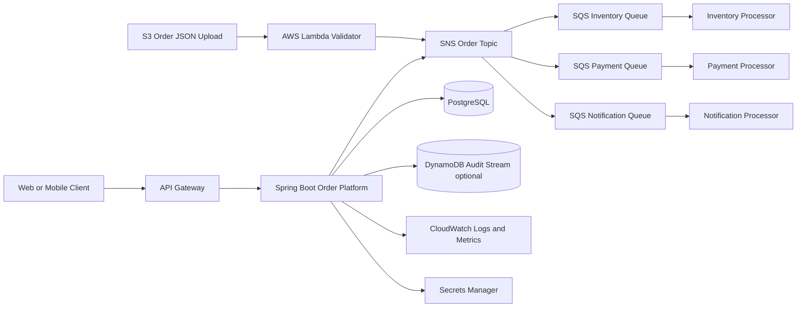
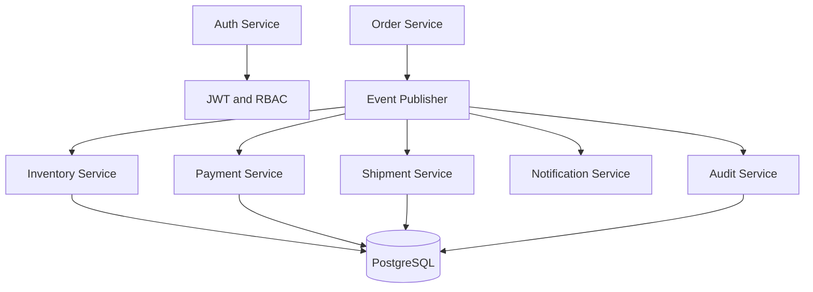
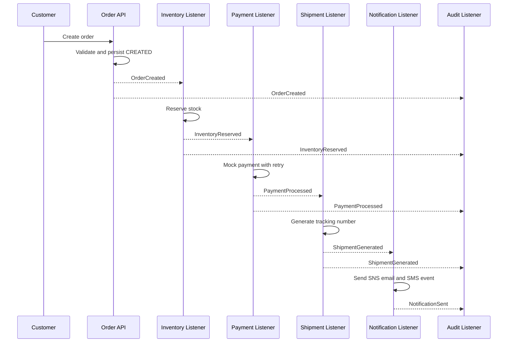
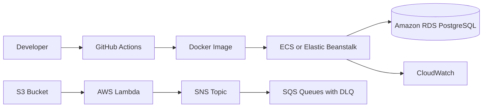
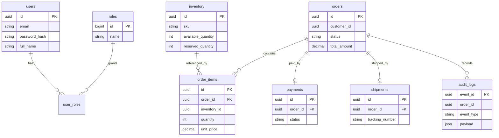
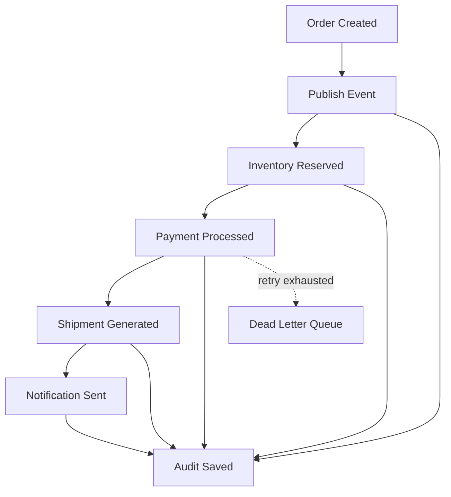

# Mermaid Diagrams

## High Level Architecture

```mermaid
flowchart LR
    Client[Web or Mobile Client] --> APIGW[API Gateway]
    APIGW --> App[Spring Boot Order Platform]
    Upload[S3 Order JSON Upload] --> Lambda[AWS Lambda Validator]
    Lambda --> SNS[SNS Order Topic]
    App --> PG[(PostgreSQL)]
    App --> SNS
    SNS --> SQS1[SQS Inventory Queue]
    SNS --> SQS2[SQS Payment Queue]
    SNS --> SQS3[SQS Notification Queue]
    SQS1 --> Inventory[Inventory Processor]
    SQS2 --> Payment[Payment Processor]
    SQS3 --> Notification[Notification Processor]
    App --> Audit[(DynamoDB Audit Stream optional)]
    App --> CloudWatch[CloudWatch Logs and Metrics]
    App --> Secrets[Secrets Manager]
```

## Component Diagram

```mermaid
flowchart TB
    Auth[Auth Service] --> Security[JWT and RBAC]
    Orders[Order Service] --> Events[Event Publisher]
    Events --> Inventory[Inventory Service]
    Events --> Payment[Payment Service]
    Events --> Shipment[Shipment Service]
    Events --> Notification[Notification Service]
    Events --> Audit[Audit Service]
    Inventory --> DB[(PostgreSQL)]
    Payment --> DB
    Shipment --> DB
    Audit --> DB
```

## Sequence Diagram

```mermaid
sequenceDiagram
    participant C as Customer
    participant O as Order API
    participant I as Inventory Listener
    participant P as Payment Listener
    participant S as Shipment Listener
    participant N as Notification Listener
    participant A as Audit Listener
    C->>O: Create order
    O->>O: Validate and persist CREATED
    O-->>I: OrderCreated
    O-->>A: OrderCreated
    I->>I: Reserve stock
    I-->>P: InventoryReserved
    I-->>A: InventoryReserved
    P->>P: Mock payment with retry
    P-->>S: PaymentProcessed
    P-->>A: PaymentProcessed
    S->>S: Generate tracking number
    S-->>N: ShipmentGenerated
    S-->>A: ShipmentGenerated
    N->>N: Send SNS email and SMS event
    N-->>A: NotificationSent
```

## Deployment Diagram

```mermaid
flowchart LR
    Dev[Developer] --> GH[GitHub Actions]
    GH --> Image[Docker Image]
    Image --> ECS[ECS or Elastic Beanstalk]
    ECS --> RDS[(Amazon RDS PostgreSQL)]
    S3[S3 Bucket] --> Lambda[AWS Lambda]
    Lambda --> SNS[SNS Topic]
    SNS --> SQS[SQS Queues with DLQ]
    ECS --> CloudWatch[CloudWatch]
```

## Database Diagram

```mermaid
erDiagram
    users ||--o{ user_roles : has
    roles ||--o{ user_roles : grants
    orders ||--o{ order_items : contains
    orders ||--o| payments : paid_by
    orders ||--o| shipments : shipped_by
    orders ||--o{ audit_logs : records
    inventory ||--o{ order_items : referenced_by
    users {
        uuid id PK
        string email
        string password_hash
        string full_name
    }
    roles {
        bigint id PK
        string name
    }
    orders {
        uuid id PK
        uuid customer_id
        string status
        decimal total_amount
    }
    order_items {
        uuid id PK
        uuid order_id FK
        uuid inventory_id
        int quantity
        decimal unit_price
    }
    inventory {
        uuid id PK
        string sku
        int available_quantity
        int reserved_quantity
    }
    payments {
        uuid id PK
        uuid order_id FK
        string status
    }
    shipments {
        uuid id PK
        uuid order_id FK
        string tracking_number
    }
    audit_logs {
        uuid event_id PK
        uuid order_id
        string event_type
        json payload
    }
```

## Event Flow Diagram

```mermaid
flowchart TD
    A[Order Created] --> B[Publish Event]
    B --> C[Inventory Reserved]
    C --> D[Payment Processed]
    D --> E[Shipment Generated]
    E --> F[Notification Sent]
    B --> G[Audit Saved]
    C --> G
    D --> G
    E --> G
    F --> G
    D -. retry exhausted .-> DLQ[Dead Letter Queue]
```
